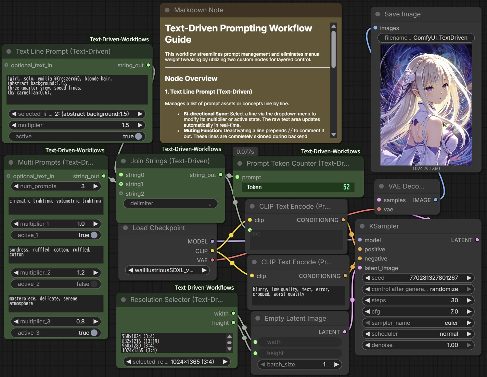
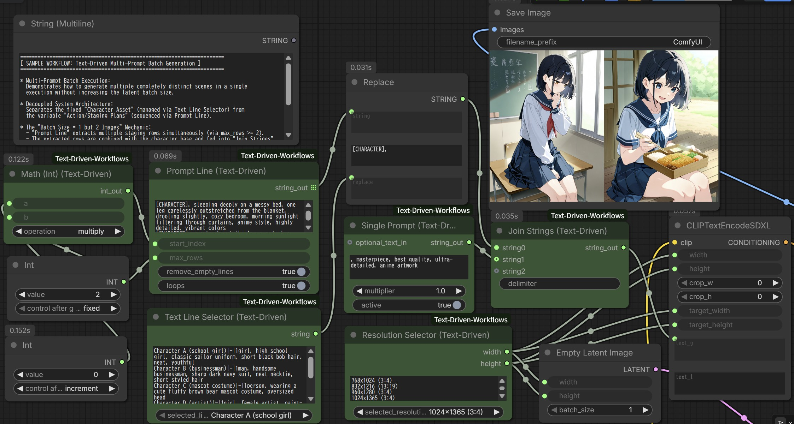

# ComfyUI-Text-Driven-Workflows

A smart, modular ComfyUI extension designed to streamline and supercharge text-driven workflows. This extension enables you to systematically organize, aggregate, and switch massive libraries of prompt formulas or character configurations with a single click, allowing you to batch-process multiple staging and direction plans simultaneously without cluttering your workspace.

By decoupling the "Character Core" from the "Scene/Staging Direction", you can build an agile, studio-grade prompt generation pipeline natively within ComfyUI V3.

---

## Key Features

* **Complete Prompt Modularization:** Separate your structural staging (lighting, camera angles, environment) from character prompts and swap them dynamically.
* **Native ComfyUI V3 Engine Support:** Built from the ground up using the latest ComfyUI V3 declarative API (`comfy_api.latest.io`), utilizing native features like safe dynamic `Autogrow` inputs.
* **Smart Batch Processing:** Extract, sequence, and loop string arrays natively to feed batch image generation queues perfectly.
* **Fault-Tolerant Execution:** Handles optional disconnected pins and extreme calculation bounds gracefully without throwing runtime workflow crashes.

---

## Sample Workflows

Two structured sample projects are available in the `examples/` directory to demonstrate the practical capabilities and synergies of this extension:

1. **text_driven_prompting_sample.json (Layered Prompting Synergy)**
   
   * **Purpose:** Demonstrates the core pipeline workflow using the newly introduced dynamic nodes.
   * **How it works:** The overall prompt is finely segmented across the two nodes on the left. With simple mouse clicks, you can instantly adjust attention weight multipliers for specific prompt parts or skip them entirely. These segmented components are then concatenated by the *Join Strings* node and fed directly into the CLIP Text Encode.

2. **text_driven_batch_sample.json (Automated Grid Generation)**
   
   * **Purpose:** A minimal example demonstrating a batch generation setup that executes two or more prompts simultaneously in a single run.
   * **How it works:** By utilizing the custom nodes provided in this extension library, you can execute multiple prompts concurrently in parallel. In this sample, you can select from 5 types of characters via a combobox, while 5 different situations automatically switch with each execution loop. This allows you to generate images for up to 25 different scenario combinations simultaneously (rendering 2 or more images at once) while freely modifying settings on the fly.

---

## Included Nodes

### 1. Join Strings (Text-Driven)
Concatenates multiple string inputs into a single text block using a custom defined delimiter.
* **Inputs:**
  * `delimiter` (String, Default: `""`): The string used to separate the text fragments (e.g., `, ` or `\n`).
  * `string_inputs` (Autogrow Input): Dynamically expanding input slots.
* **Behavior:** Fully compliant with ComfyUI V3's native 0-indexed Autogrow behavior (`string0`, `string1`, etc.). Connecting a line from another node to an input pin automatically generates and increments a new input pin. It extracts index markers via regular expressions, sorts them numerically to maintain strict structural ordering, and joins them into a unified prompt block.

### 2. Math (Int) (Text-Driven)
An advanced integer arithmetic core designed to calculate loops, steps, dimensions, and indexing logic safely.
* **Inputs:**
  * `a` / `b` (Int, Range: -999,999,999 to 999,999,999): Supports massive integer ranges.
  * `operation` (Combo Select): `add`, `subtract`, `multiply`, `divide`, `modulo`, `power`, `shift`.
* **Advanced Logic:**
  * `divide` / `modulo`: Allows natural zero-division runtime exceptions to propagate upstream safely.
  * `power`: Implements safety range-guards to prevent system-freezing overflow.
  * `shift` (Smart Bit-Shift): Intelligently reads the sign of `b`. Performs a standard Left Shift (`a << b`) if `b >= 0`, and automatically switches to a Right Shift (`a >> abs(b)`) if `b < 0` (capped safely at 31 bits).

### 3. Multi Prompts (Text-Driven)
Allows simultaneous editing and management of multiple independent prompts within a single node.
* **Inputs:**
  * `num_prompts` (Combo, Options: `1` - `10`, Default: `3`): The number of active visible slots.
  * `optional_text_in` (String, Force Input, Optional): An upstream text fragment to merge.
  * `text_1` to `text_10` (String, Multiline): Individual prompt fragment slots.
  * `multiplier_1` to `multiplier_10` (Float, Default: `1.0`, Range: `0.0` - `10.0`): Weight factors for each slot.
  * `active_1` to `active_10` (Boolean, Default: `True`): Toggles the output state of each slot.
* **Behavior:** The text input fields dynamically expand or shrink based on the specified number to keep your workspace clean. You can toggle individual weights and output active states for each slot. All active prompts are automatically joined into a single comma-separated string output. It automatically strips trailing zeros from floating numbers (e.g., `1.10` becomes `1.1`) to ensure clean prompt injection.

### 4. Prompt Line (Text-Driven)
Extracts specific lines from a multi-line text block to output as a structured string list, fully supporting batch image generation workflows.
* **Visual Identifiers:** Distinctive dark green design (`color: #225522`, `bgcolor: #33aa33`).
* **Inputs:**
  * `prompt` (String, Multiline): The source asset block containing your lines/prompts.
  * `start_index` (Int, Default: `0`): The line index to begin extraction.
  * `max_rows` (Int, Default: `1000`): Maximum lines to extract.
  * `remove_empty_lines` (Boolean, Default: `True`): Automatically cleans up whitespace and dead lines.
  * `loops` (Boolean, Default: `False`): Wraparound toggle.
* **Behavior:** Specialized for batch image generation. By setting `max_rows` to 2 or more, it outputs multiple prompt lines simultaneously, executing multiple prompts in a single batch generation run. The list output can be passed to downstream string manipulation nodes. If `loops` is `True`, it loops back to index 0 when the requested row count exceeds available lines.

### 5. Resolution Selector (Text-Driven)
A dedicated resolution management utility designed to store preset aspect ratios and target dimensions externally.
* **Inputs:**
  * `selected_resolution` (Combo Select): Dropdown list containing preset resolution dimensions.
* **Behavior:** Allows you to register major resolution pairs and switch between them instantly via a clean dropdown menu. It outputs the width and height dimensions directly into downstream generator or latent nodes, eliminating manual typing and aspect ratio calculation mistakes. Optimized out-of-the-box for popular SDXL aspect ratios.

### 6. Single Prompt (Text-Driven)
Manages a single prompt fragment with precision multiplier weighting and master active status control.
* **Inputs:**
  * `text` (String, Multiline): The primary prompt fragment.
  * `optional_text_in` (String, Force Input, Optional): An upstream text fragment to merge.
  * `multiplier` (Float, Default: `1.0`, Range: `0.0` - `10.0`): Weight adjustment factor.
  * `active` (Boolean, Default: `True`): Master bypass switch. If `False`, outputs an empty string instantly.
* **Behavior:** Automatically combines `text` and `optional_text_in` with correct spacing. If the multiplier is not `1.0`, it cleanly wraps the final text into standard attention weight syntax: `(combined_text:multiplier)`. Built to handle unlinked optional pins flawlessly.

### 7. Text Line Prompt (Text-Driven)
An innovative bi-directional editing node that allows intuitive control of extensive prompt assets or line-separated concepts within a single text area.
* **Inputs:**
  * `text` (String, Multiline): The main multi-line prompt database text area.
  * `selected_line` (Combo, Dynamically Managed): Populated dynamically to track and choose lines.
  * `multiplier` (Float, Default: `1.0`, Range: `0.0` - `10.0`): Real-time weight scaler for the selected line.
  * `active` (Boolean, Default: `True`): Toggles active status for the selected line.
  * `optional_text_in` (String, Force Input, Optional): An upstream text fragment to prepend.
* **Behavior:** Selecting a line via the combobox lets you modify its multiplier or active state via UI controls, directly rewriting the target line's string layout in real-time. Deactivated lines are commented out with `//` on the fly and automatically skipped during backend execution to yield a clean string. It handles character LoRA escaped brackets `\( \)` properly while safely bypassing rows containing multiple unescaped brackets to prevent formatting damage. Trailing zeros are automatically dropped for clean syntax (e.g., `1.1`).

### 8. Text Line Selector (Text-Driven)
A studio-grade scenario switch designed to store massive direction and staging plans externally.
* **Inputs:**
  * `text` (String, Multiline): Multi-line scenario database.
  * `selected_line` (Combo Select): Recalls direction presets based on labels.
* **Behavior:** Allows you to record dozens of rich staging configurations within the node and recall them instantly via a clean drop-down selector. You can input a label and the custom delimiter `|-|` (e.g., `Label|-|Prompt`) for each line of the multi-line text, which makes the options in the combo box much easier to read and select. It seamlessly pipes the chosen scenario prompt into downstream prompt-assembly nodes.
### Workflow Breakdown & Key Mechanics
This sample project demonstrates a highly automated, multi-prompt batch generation pipeline utilizing the following core mechanics:

* **The "Batch Size = 1 but 2 Images" Mechanic:**
  - The **`Prompt Line`** node extracts two distinct action rows simultaneously (`max_rows = 2`).
  - These rows are combined with the character base from **`Text Line Selector`** and fed into **`Join Strings`**.
  - ComfyUI's KSampler detects the multiple text conditioning inputs and automatically generates two completely unique scenes simultaneously, even though the latent `batch_size` remains set to 1.
* **Full Automation via Auto-Increment:**
  - An external `Int` node configured with `control after generate: increment` is routed into the `start_index` pin. 
  - This allows the workflow to automatically sequence through up to 25 different scene combinations sequentially on every queue execution for hands-free matrix collection.
* **Native SDXL Driving:**
  - The **`Resolution Selector`** seamlessly controls dimensions for both the latent generator and CLIP text encoding nodes simultaneously to prevent aspect ratio distortion.
---

## Installation

### Via ComfyUI Manager (Recommended)

1. Open ComfyUI and click on the **Manager** button.
2. Search for `ComfyUI Text-Driven Workflows`.
3. Click **Install**, then restart ComfyUI.

### Manual Git Clone

Navigate to your ComfyUI custom nodes directory and run:

```bash
cd ComfyUI/custom_nodes
git clone https://github.com/kanryu/ComfyUI-Text-Driven-Workflows.git

```

Restart your ComfyUI server to load the extension.

* **Note:**  No external Python dependencies required (pure ComfyUI V3 API).
---

## License

This project is licensed under the **GNU GPLv3 License** - see the LICENSE file for details. Developed and maintained by **KATO Kanryu** ([k.kanryu@gmail.com](mailto:k.kanryu@gmail.com)).
